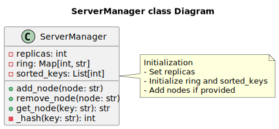
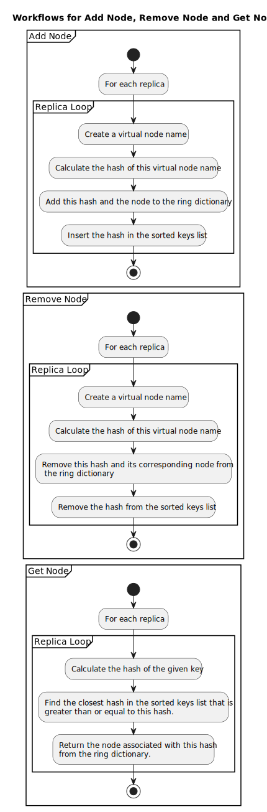

# Distributed Video Storage System API

## Introduction
This project provides an API for administering a distributed storage system. It's designed to manage and interact with a distributed environment where data is stored and retrieved efficiently. The system is primarily focused on video data management.

## Architecture

### Persistence Layer
#### VideoRepository Class 
This class serves as the in-memory storage component, implemented using a Python dictionary. It's designed for 
simplicity and quick access. However, the implementation can be extended or modified to connect to actual storage 
servers for a more persistent and robust storage solution.

#### Server Manager
**Consistent Hashing**  
The server manager uses a consistent hashing algorithm to distribute video storage across various servers. This method 
provides a scalable and efficient way to add or remove servers with minimal reshuffling of data. 

**How Consistent Hashing Works**  
Consistent hashing maps data to physical servers.  
When a server is added or removed, only a small portion of the data 
is re-mapped, significantly reducing the overhead compared to traditional hashing methods.

Consistent Hashing is often conceptualized and represented by the following conceptual circle:


- Each node in the system (server) is assigned a position on this ring through hashing its identifier.
- Multiple nodes can refer to one single server (they are called virtual nodes) to have a more balanced distribution 
of data
- For each new data, it is also hashed to a position on the ring.   
The data is then stored on the node that is closest in the clockwise direction.
of data across nodes

**Implementation**  
The implementation of this algorithm can be found in the [ServerManager](https://github.com/Yinshangyi/video-store-consistent-hashing/blob/main/src/repository/server_manager.py) class.


The circle is represented by a Python Dictionary (Dict[int, str]). It contains all the virtual nodes.
A sorted array contained all the hashes and keep them that order.  
It is necessary to find the first node in the circle greater or equal than the hash of the data we want to store.  



### API Layers
- **Web/Controller Layer**  
This layer handles HTTP requests and responses, providing the interface through which users interact with the storage system.


- **Service Layer**  
It encapsulates the business logic of the application, interacting with the persistence layer to perform data operations.


- **Repository Layer**  
This layer is responsible for data storage and retrieval, abstracted in the `VideoRepository` class.

## Testing
**Unit Tests**  
Unit tests have been implemented for both the service and web layers.  

## Getting Started
A Dockerfile is provided if you wish to run the application with Docker (which is recommended to avoid version issues).
```bash
docker build -t <IMAGE_NAME> .
```
```bash
docker run -p 5000:5000 --name <CONTAINER_NAME> <IMAGE_NAME>
```

A script is also provided to build the Docker image if it doesn't exist yet and to run the container:
```bash
./run_app.sh
```

### Demo 
A Python script is provided to store set of sample videos to populate the video store.  
You can run it like so:
```bash
python demo_setup.py
```
Note: The script requires to have the requests library installed.
You can make use of requirements.txt and create a virtual environment.

You can then query all the stored videos doing the following GET request:
```
curl "http://localhost:5000/video?details=true"
```

You will get the following JSON:
```json
{
    "Server1": [
        "Toy-Story-4.mp4",
        "Toy-Story-3.mp4",
        "The-Super-Mario-Bros.-Movie.mp4",
        "Star-Wars-The-Force-Awakens.mp4",
        "Spider-Man-No-Way-Home.mp4",
        "Jurassic-World.mp4",
        "Joker.mp4",
        "Iron-Man-3.mp4",
        "Despicable-Me-3.mp4",
        "Black-Panther.mp4",
        "Beauty-and-the-Beast.mp4",
        "Barbie.mp4",
        "Avengers-Endgame.mp4",
        "The-Avengers.mp4",
        "Aquaman.mp4",
        "Alice-in-Wonderland.mp4",
        "Aladdin.mp4"
    ],
    "Server2": [
        "Zootopia.mp4",
        "Top-Gun-Maverick.mp4",
        "Titanic.mp4",
        "Pirates-of-the-Caribbean-On-Stranger-Tides.mp4",
        "Harry-Potter-and-the-Deathly-Hallows-–-Part-2.mp4",
        "Captain-Marvel.mp4",
        "Captain-America-Civil-War.mp4",
        "Avengers-Infinity-War.mp4",
        "Avatar-The-Way-of-Water.mp4"
    ],
    "Server3": [
        "Transformers-Dark-of-the-Moon.mp4",
        "Transformers-Age-of-Extinction.mp4",
        "Star-Wars-The-Rise-of-Skywalker.mp4",
        "Star-Wars-The-Last-Jedi.mp4",
        "Star-Wars-Episode-I-–-The-Phantom-Menace.mp4",
        "Spider-Man-Far-From-Home.mp4",
        "Skyfall.mp4",
        "Rogue-One-A-Star-Wars-Story.mp4",
        "Pirates-of-the-Caribbean-Dead-Man's-Chest.mp4",
        "Minions.mp4",
        "The-Lord-of-the-Rings-The-Return-of-the-King.mp4",
        "The-Lion-King.mp4",
        "Jurassic-World-Fallen-Kingdom.mp4",
        "Jurassic-Park.mp4",
        "Incredibles-2.mp4",
        "The-Hobbit-An-Unexpected-Journey.mp4",
        "Furious-7.mp4",
        "Frozen-II.mp4",
        "Frozen.mp4",
        "Finding-Dory.mp4",
        "The-Fate-of-the-Furious.mp4",
        "The-Dark-Knight-Rises.mp4",
        "Avengers-Age-of-Ultron.mp4",
        "Avatar.mp4"
    ]
}
```

## API Routes Documentation

### 1. Add Server

- **URL:** `/server/<server_name>`
- **Method:** `POST`
- **URL Params:** 
  - **Required:** 
    - `server_name` (string): Name of the server to be added.
- **Success Response:**
  - **Code:** 200
  - **Content:** `"A new server: <server_name> has been added"`
- **Description:** 
  - Adds a new server to the video service.

---

### 2. Remove Server

- **URL:** `/server/<server_name>`
- **Method:** `DELETE`
- **URL Params:** 
  - **Required:** 
    - `server_name` (string): Name of the server to be removed.
- **Success Response:**
  - **Code:** 200
  - **Content:** `"The server: <server_name> has been removed"`
- **Description:** 
  - Removes a server from the video service.

---

### 3. Store Video

- **URL:** `/video/<video_name>`
- **Method:** `POST`
- **URL Params:** 
  - **Required:** 
    - `video_name` (string): Name of the video to be stored.
- **Success Response:**
  - **Code:** 200
  - **Content:** `"The video: <video_name> has been saved"`
- **Description:** 
  - Stores a video in the video service.

---

### 4. Get Video(s)

- **URL:** `/video`
- **Method:** `GET`
- **Query Params:** 
  - **Optional:** 
    - `details` (string): If 'true', returns all videos by server. Defaults to 'false'.
- **Success Response:**
  - **Code:** 200
  - **Content:** List of video names or videos by server.
- **Description:** 
  - Retrieves all video names or, if details are set to 'true', retrieves all videos by server.

Example with details=true
```json
{
    "Server1": [
        "Toy-Story-4.mp4",
        "Toy-Story-3.mp4",
        "The-Super-Mario-Bros.-Movie.mp4"
    ],
    "Server2": [
        "Zootopia.mp4",
        "Top-Gun-Maverick.mp4"
    ],
    "Server3": [
        "The-Fate-of-the-Furious.mp4",
        "The-Dark-Knight-Rises.mp4",
        "Avengers-Age-of-Ultron.mp4",
        "Avatar.mp4"
    ]
}
```

Example with details=false or not provided
```json
 [
    "Toy-Story-4.mp4",
    "Toy-Story-3.mp4",
    "The-Super-Mario-Bros.-Movie.mp4",
    "Zootopia.mp4",
    "Top-Gun-Maverick.mp4",
    "The-Fate-of-the-Furious.mp4",
    "The-Dark-Knight-Rises.mp4",
    "Avengers-Age-of-Ultron.mp4",
    "Avatar.mp4"
]
```
---


